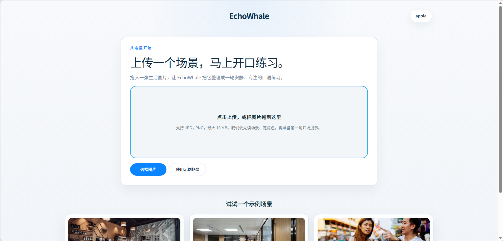
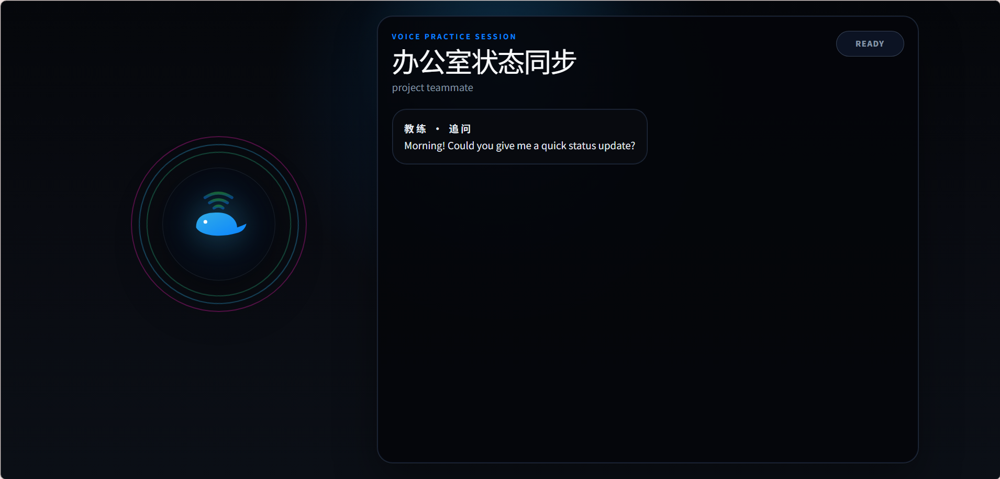
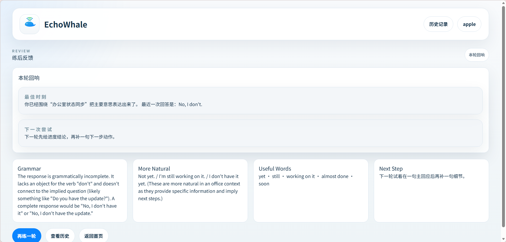

<div align="center">


# EchoWhale v0.1.0

**图片驱动的英语情景对话陪练**

*Upload a photo. Start a real-scene English conversation. Get actionable feedback.*

[](https://github.com/ZT1314888/EchoWhale)

---

[](https://www.python.org/)
[](https://fastapi.tiangolo.com/)
[](https://react.dev/)
[](https://www.postgresql.org/)
[](https://redis.io/)
[](LICENSE)
[](https://github.com/ZT1314888/EchoWhale/pulls)

简体中文 | *English（TODO）*

</div>

## 简介

EchoWhale 是一个面向日常口语初中级学习者的情景式英语陪练系统。用户上传一张日常生活照片，系统识别场景与关键物体，自动发起角色化英语对话，并在每轮回复后给出结构化的学习反馈——语法纠错、更自然表达、推荐词汇。

上传一张照片，3 分钟内完成一轮完整的情景英语对话练习。

## 核心特性

- **场景识别** -- 上传照片，自动检测场景类型、角色设定与开场白
- **角色对话** -- 基于真实场景的角色化英语对话，每轮推动一个交流目标
- **即时反馈** -- 每轮返回语法纠错、自然表达建议、场景词汇推荐
- **语音练习** -- 集成 Deepgram 实时语音 Agent，支持开口练习
- **会话回顾** -- 练习结束后查看本轮复盘与历史记录
- **示例场景** -- 内置咖啡店点单、办公室交流、街头问路等预设场景

## 界面预览

> 截图待补充，请运行前端后截图放入 `docs/screenshots/`。

<table align="center">
  <tr>
    <td align="center"><b>首页上传</b></td>
    <td align="center"><b>练习会话</b></td>
    <td align="center"><b>学习反馈</b></td>
  </tr>
  <tr>
    <td></td>
    <td></td>
    <td></td>
  </tr>
</table>

## 技术栈

| 层级 | 技术 |
|------|------|
| **后端** | Python 3.12+, FastAPI, SQLAlchemy, PostgreSQL, Alembic |
| **前端** | React 19, Vite 6, TypeScript, Tailwind CSS 4, React Router 7 |
| **AI / 视觉** | OpenAI 兼容视觉 API（主备双通道） |
| **语音** | Deepgram SDK（STT + TTS 实时语音 Agent） |
| **存储** | Cloudflare R2（S3 兼容对象存储） |
| **队列** | Redis + RQ 异步任务 |
| **认证** | JWT + 邮箱验证 + 密码重置 |
| **测试** | pytest + httpx（后端）/ Vitest + Testing Library（前端） |
| **基础设施** | Docker, Cloudflare, Terraform |

## 架构概览

```
用户上传图片 ──→ scene_engine ──→ coach_engine ──→ feedback_engine
     │                │                │                 │
     └────────────────┴────────────────┴─────────────────┘
                          session_engine（会话编排）
```

| 引擎 | 职责 |
|------|------|
| `scene_engine` | 图片质量筛选 + 视觉模型场景分析 |
| `coach_engine` | 角色化对话生成（主备双通道） |
| `feedback_engine` | 语法纠错、自然表达、词汇推荐 |
| `session_engine` | 会话生命周期管理、历史、语音、复盘 |

## 项目结构

```
EchoWhale/
├── api/                  # FastAPI 后端
│   ├── main.py           # 应用入口
│   ├── core/             # 配置与安全
│   ├── routes/v1/        # API 路由（auth, media, sessions, history, deepgram）
│   ├── services/         # 应用服务层
│   ├── modules/          # AI 引擎模块
│   │   ├── scene_engine/
│   │   ├── coach_engine/
│   │   ├── feedback_engine/
│   │   └── session_engine/
│   ├── models/           # 数据模型
│   ├── db/               # 数据访问层
│   ├── integrations/     # 第三方接入（LLM, R2, Deepgram, Redis）
│   ├── tasks/            # 异步任务
│   └── migrations/       # Alembic 数据库迁移
├── frontend/             # React 前端
│   └── src/
│       ├── pages/        # 页面组件
│       ├── components/   # 通用组件
│       ├── hooks/        # 自定义 Hook（语音 Agent、语音识别）
│       ├── services/     # API 调用层
│       └── auth/         # 认证上下文
├── tests/                # 后端回归测试
├── docs/                 # 产品文档与治理
├── infra/                # Docker, Cloudflare, Terraform
├── designs/              # UI 设计资产（Pencil）
├── tools/                # 仓库治理工具
└── .env.example          # 环境变量模板
```

## 快速开始

### 前置条件

- Python 3.12+
- Node.js 18+
- PostgreSQL 15+
- Redis 7+
- [uv](https://docs.astral.sh/uv/)（Python 包管理）

### 1. 克隆仓库

```bash
git clone https://github.com/ZT1314888/EchoWhale.git
cd EchoWhale
```

### 2. 配置环境变量

```bash
cp .env.example .env
# 编辑 .env，填写数据库连接、Redis 地址、API Key 等
```

### 3. 启动后端

```bash
uv sync
uv run uvicorn api.main:app --reload --port 8001
```

### 4. 启动前端

```bash
cd frontend
npm install
npm run dev
```

开发模式下，Vite 会自动将 `/api/*` 请求代理到 `http://localhost:8001`。如需指定后端地址，设置 `VITE_API_PROXY_TARGET` 环境变量。

### 5. 数据库迁移

```bash
uv run alembic upgrade head
```

### 6. 验证

- 前端：http://localhost:5173
- 后端健康检查：http://localhost:8001/health
- API 文档：http://localhost:8001/docs

## 环境变量

完整变量列表见 [.env.example](.env.example)，以下为关键分组：

| 分组 | 核心变量 | 说明 |
|------|----------|------|
| **应用基础** | `APP_ENV`, `API_PREFIX`, `ALLOWED_ORIGINS` | 运行环境与跨域配置 |
| **数据库** | `DATABASE_URL`, `DATABASE_POOL_SIZE` | PostgreSQL 连接与连接池 |
| **Redis** | `REDIS_URL`, `AUTH_MAIL_QUEUE_NAME` | 缓存与异步邮件队列 |
| **SMTP** | `AUTH_SMTP_HOST`, `AUTH_SMTP_PASSWORD` | 邮件发送（注册验证、密码重置） |
| **Cloudflare R2** | `R2_BUCKET`, `R2_ACCESS_KEY_ID` | 图片存储 |
| **视觉模型** | `VISION_PRIMARY_*`, `VISION_FALLBACK_*` | 场景识别主备模型 |
| **文本模型** | `TEXT_PRIMARY_*`, `TEXT_FALLBACK_*` | 对话与反馈主备模型 |
| **Deepgram** | `DEEPGRAM_API_KEY`, `DEEPGRAM_AGENT_*` | 实时语音 Agent |
| **运行模式** | `MODEL_RUNTIME_MODE` | `mock`（开发）/ `live`（生产） |

> 开发阶段可将 `MODEL_RUNTIME_MODE` 设为 `mock`，无需配置真实模型 API Key 即可运行。

## API 概览

所有接口前缀为 `/api/v1/`，完整文档见 `/docs`（Swagger UI）。

| 模块 | 方法 | 路径 | 说明 |
|------|------|------|------|
| **Auth** | POST | `/auth/register` | 注册 |
| | POST | `/auth/login` | 登录 |
| | POST | `/auth/refresh` | 刷新令牌 |
| | GET | `/auth/me` | 当前用户 |
| | POST | `/auth/verify-email` | 邮箱验证 |
| | POST | `/auth/forgot-password` | 忘记密码 |
| | POST | `/auth/reset-password` | 重置密码 |
| | POST | `/auth/logout` | 登出 |
| **Media** | POST | `/media/upload` | 上传图片 |
| | GET | `/media/{id}` | 获取元数据 |
| | GET | `/media/{id}/access-url` | 获取签名 URL |
| **Sessions** | POST | `/sessions` | 创建会话 |
| | GET | `/sessions/{id}` | 获取会话状态 |
| | POST | `/sessions/{id}/reply` | 回复对话 |
| | GET | `/sessions/{id}/review` | 获取复盘 |
| | POST | `/sessions/{id}/voice/bootstrap` | 语音会话引导 |
| | POST | `/sessions/{id}/voice/complete` | 语音会话完成 |
| **History** | GET | `/history/sessions` | 会话列表（游标分页） |
| | GET | `/history/sessions/{id}` | 会话详情 |
| | GET | `/history/sessions/{id}/messages` | 消息列表 |
| **Deepgram** | POST | `/deepgram/think/chat/completions` | Think 模型代理（SSE） |
| **Health** | GET | `/health` | 健康检查 |

## 测试

```bash
# 后端测试
uv run pytest

# 前端测试
cd frontend && npm test
```

## 开发说明

### Mock 模式与 Live 模式

`MODEL_RUNTIME_MODE` 控制模型调用行为：

- **`mock`**：所有 LLM 调用返回预设数据，无需配置 API Key，适合本地开发与测试
- **`live`**：调用真实模型 API，需配置对应 Provider 的 Base URL、API Key 和 Model 名称

每个引擎支持独立的主备通道：`VISION_PRIMARY_*` / `VISION_FALLBACK_*`、`TEXT_PRIMARY_*` / `TEXT_FALLBACK_*`。

### 代码风格

- 后端：模块化分层（routes → services → modules → db）
- 前端：函数组件 + Hooks，页面组件与通用组件分离
- Agent 协作：参见 [AGENTS.md](AGENTS.md)

## 参与贡献

1. Fork 本仓库
2. 创建功能分支：`git checkout -b feature/your-feature`
3. 提交变更：`git commit -m "feat: 简短描述"`
4. 推送分支：`git push origin feature/your-feature`
5. 提交 Pull Request

### 提交规范

| 前缀 | 用途 |
|------|------|
| `feat:` | 新功能 |
| `fix:` | 修复 |
| `refactor:` | 重构 |
| `docs:` | 文档 |
| `test:` | 测试 |
| `chore:` | 杂项 |

## 路线图

- [x] 图片上传与场景识别
- [x] 角色化英语对话练习
- [x] 实时语音 Agent（Deepgram）
- [x] 练习复盘与历史记录
- [x] 用户认证与邮箱验证
- [ ] 生产环境部署（Docker + Cloudflare）
- [ ] 英文版 README
- [ ] 界面截图补充
- [ ] 语音发音评分

## 许可证

本项目基于 [MIT License](LICENSE) 开源。

Copyright (c) 2026 彭于晏

## 致谢

- [FastAPI](https://fastapi.tiangolo.com/) -- 后端框架
- [React](https://react.dev/) -- 前端框架
- [Deepgram](https://deepgram.com/) -- 实时语音
- [Cloudflare R2](https://www.cloudflare.com/developer-platform/r2/) -- 对象存储
- [Tailwind CSS](https://tailwindcss.com/) -- 样式方案

---

<div align="center">

如果这个项目对你有帮助，请给一个 Star ⭐

</div>
